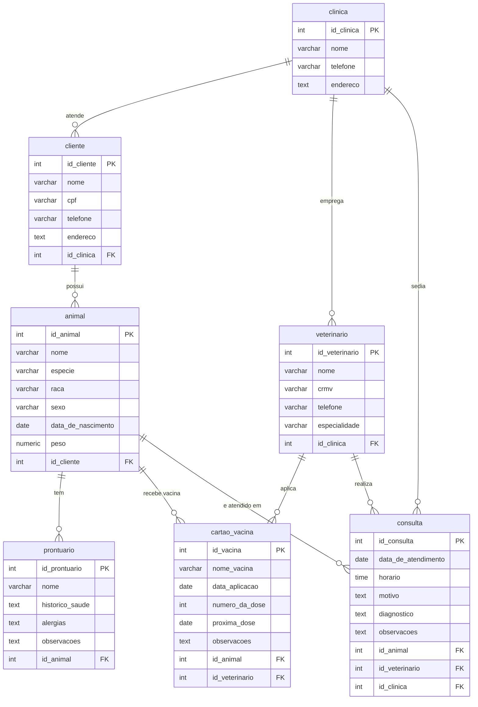

```mermaid
erDiagram
    clinica {
        int id_clinica PK
        varchar nome
        varchar telefone
        text endereco
    }

    cliente {
        int id_cliente PK
        varchar nome
        varchar cpf
        varchar telefone
        text endereco
        int id_clinica FK
    }

    veterinario {
        int id_veterinario PK
        varchar nome
        varchar crmv
        varchar telefone
        varchar especialidade
        int id_clinica FK
    }

    animal {
        int id_animal PK
        varchar nome
        varchar especie
        varchar raca
        varchar sexo
        date data_de_nascimento
        numeric peso
        int id_cliente FK
    }

    prontuario {
        int id_prontuario PK
        varchar nome
        text historico_saude
        text alergias
        text observacoes
        int id_animal FK
    }

    cartao_vacina {
        int id_vacina PK
        varchar nome_vacina
        date data_aplicacao
        int numero_da_dose
        date proxima_dose
        text observacoes
        int id_animal FK
        int id_veterinario FK
    }

    consulta {
        int id_consulta PK
        date data_de_atendimento
        time horario
        text motivo
        text diagnostico
        text observacoes
        int id_animal FK
        int id_veterinario FK
        int id_clinica FK
    }

    clinica ||--o{ cliente : "atende"
    clinica ||--o{ veterinario : "emprega"
    clinica ||--o{ consulta : "sedia"
    cliente ||--o{ animal : "possui"
    animal ||--o{ prontuario : "tem"
    animal ||--o{ cartao_vacina : "recebe vacina"
    animal ||--o{ consulta : "e atendido em"
    veterinario ||--o{ cartao_vacina : "aplica"
    veterinario ||--o{ consulta : "realiza"
```