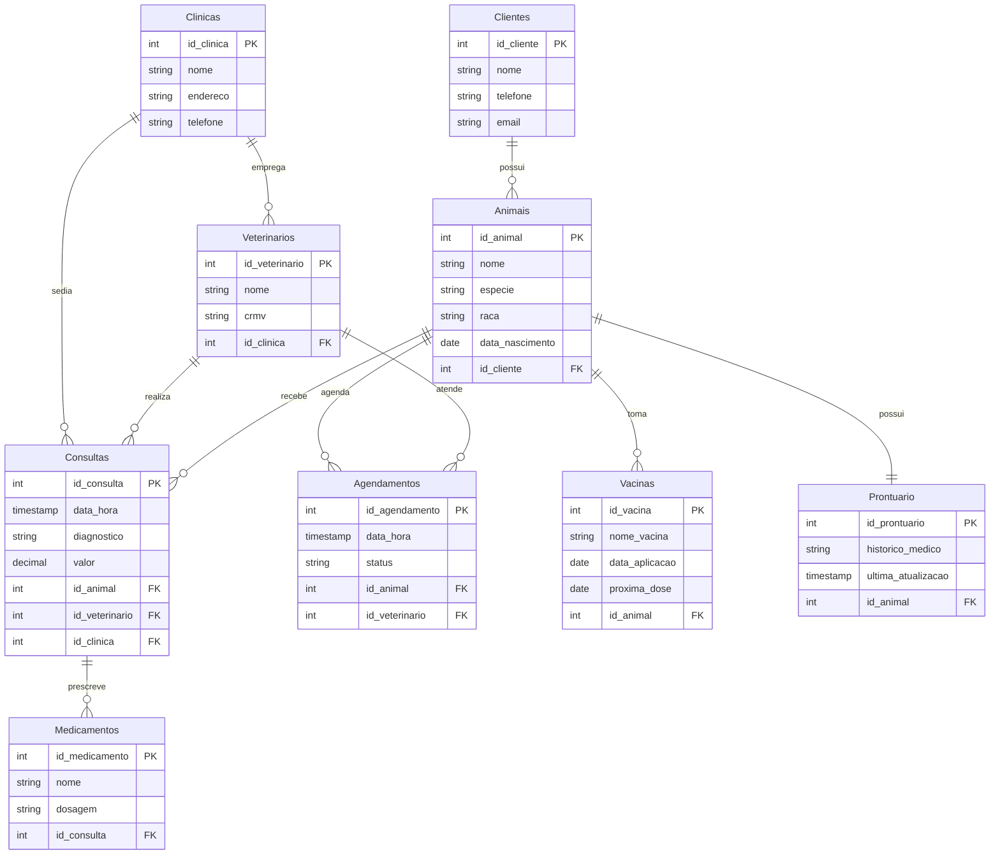

```mermaid
erDiagram
    %% --- MÓDULO 1: CADASTRO BASE & INFRAESTRUTURA ---
    Clinicas {
        int id_clinica PK
        string nome
        string endereco
        string telefone
    }

    Clientes {
        int id_cliente PK
        string nome
        string telefone
        string email
    }

    Animais {
        int id_animal PK
        string nome
        string especie
        string raca
        date data_nascimento
        int id_cliente FK
    }

    %% --- MÓDULO 2: ATENDIMENTO CLÍNICO & CONSULTAS ---
    Veterinarios {
        int id_veterinario PK
        string nome
        string crmv
        int id_clinica FK
    }

    Consultas {
        int id_consulta PK
        timestamp data_hora
        string diagnostico
        decimal valor
        int id_animal FK
        int id_veterinario FK
        int id_clinica FK
    }

    Medicamentos {
        int id_medicamento PK
        string nome
        string dosagem
        int id_consulta FK
    }

    %% --- MÓDULO 3: AGENDAMENTOS & AUTOMAÇÃO ---
    Agendamentos {
        int id_agendamento PK
        timestamp data_hora
        string status
        int id_animal FK
        int id_veterinario FK
    }

    Vacinas {
        int id_vacina PK
        string nome_vacina
        date data_aplicacao
        date proxima_dose
        int id_animal FK
    }

    Prontuario {
        int id_prontuario PK
        string historico_medico
        timestamp ultima_atualizacao
        int id_animal FK
    }

    %% --- RELACIONAMENTOS DO BANCO ---
    Clientes ||--o{ Animais : "possui"
    Clinicas ||--o{ Veterinarios : "emprega"
    Clinicas ||--o{ Consultas : "sedia"
    Veterinarios ||--o{ Consultas : "realiza"
    Animais ||--o{ Consultas : "recebe"
    Consultas ||--o{ Medicamentos : "prescreve"
    Animais ||--o{ Agendamentos : "agenda"
    Veterinarios ||--o{ Agendamentos : "atende"
    Animais ||--o{ Vacinas : "toma"
    Animais ||--|| Prontuario : "possui"
```